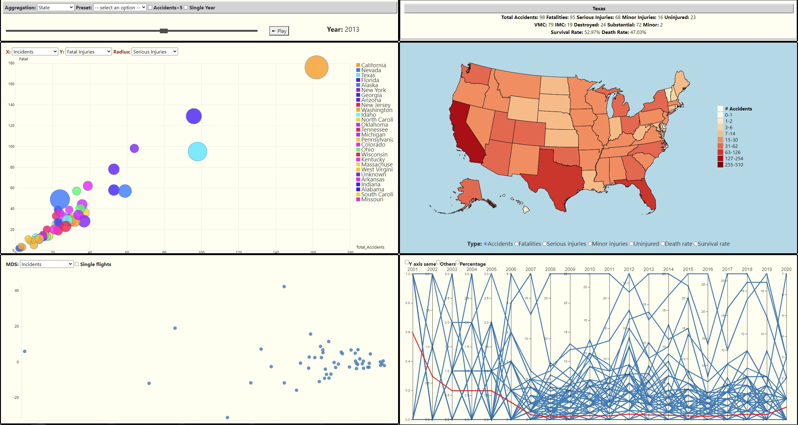

# Aviation-accidents-visualizations
Project for the visual analytics course 2020-21 at Sapienza University of Rome. 

A demo of the project is hosted [here](https://luigisigillo.github.io/Aviation-accidents-visualizations/).

A complete report is available [here](legacy/Report.pdf), while a overview of the project is in [this presentation](legacy/USAaviationcrashes.pdf)

## Introduction
We decided to focus on USA aircraft accidents because an analysis of this data can be useful to different kind of users that want to have insights about aircraft crashes. In order to do that, we needed to find a way to represent information such that accidents could be easily plotted, analyzed and understood, supporting NTSB (National Transportation Safety Board) authorities inmonitoring the situation and, if necessary, conceiving plan of actions.

Also pilots that want to buy a new aircraft can be helped in the decision by the different kind of visual-izations: in particular the information on manufacturers (i.e.  Fatalities, Weather Conditions, Death Rate,etc.) could be very useful when deciding which aircraft to buy.Therefore, we realized four types of visualization.

### Aircraft Crashes Maps
Aircraft Crashes Maps used to understand the geographic aircraft crashes distribution, identifyinghotspots, and highlight states with different death rate and fatalities.  Once a particular area has beendetected, a more precise study can be carried on by analyzing the description in the upper right sideof the page.

### Parallel Coordinates
Parallel Coordinates are specifically addressed to find patterns, analyzing every aircraft crash com-posing a subject (states/manufacturer/month/phase) over time.  This information can be comparedwith the overall average values of the dataset entries.

### Multidimensional Scaling
Multidimensional Scaling Projectio nwas inserted to better visualize the relationships among thedata points without having to compare each of them one by one. The possibility of having interactionbetween the user and the visualizations allows to better inspect some data and to give informationabout their relative differences.

### Bubble plot

Bubble Plot has been designed and implemented in order to be highly customizable and flexible indisplaying the data.  In fact, the user can interact with this visualization, by modifying the axes, radiusand the aggregation to be displayed, in order to highlight and extrapolate different characteristics fromthe data.

## Authors 

Giuliano Martinelli 

Luigi Sigillo 

Mattia Pocci 

